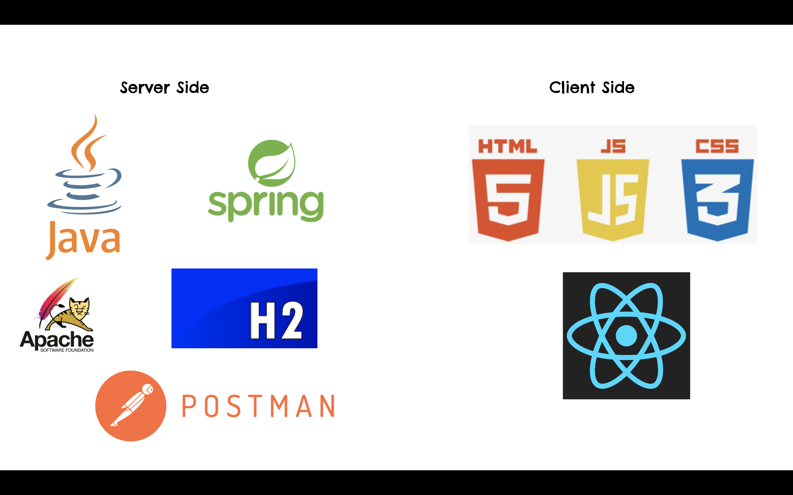

# Seraphine

> Seraphine is a web-based smart eHealth booking app, which allows clients to book an Appointment with doctors from home. Seraphine is named after a character in the famous game Leauge of Legend (LOL), whose skill is healing for the whole team, therefore, we name the project with hope the project will help people in healing and recover their pain. Seraphine is written in Java Spring Boot (for Backend) and ReactJS (for Frontend — currently in development).
> 

# ☎️ Contact information

- If there is any problem, please do not hesitate to contact us!

📧 Email address: luckyandvinh@gmail.com

---
# 📖 Documentation

- Our requirement from teacher: [Requirement](https://github.com/thvinhtruong/seraphine/blob/main/eHealth.pdf)
- **Our API document (generated with Javadoc): [API Doc](https://javadoc-seraphine.netlify.app)**
- Our main document for the project: [Project Report](https://github.com/thvinhtruong/seraphine/blob/main/Group_19___EHealth__Java___Object_Oriented_Programming.pdf]


---

# **👩🏻‍💻** Installation

### 1. Java Spring Boot

[https://spring.io](https://spring.io/)

You need to install java with latest version (we use Java 17) to run the application and customize all the necessary dependecies in the website. Remember to install maven - java pakage manager.

### 2. ReactJS

[https://reactjs.org](https://reactjs.org/)

Install Node and npm (we use Node version 16.9.1 and npm version 7.21.1 to run the frontend. We still not gather all the stuffs 🙂 so sorry for that :

---

# 🤖 Technologies We Used



---

# 🏃 Run

1. Clone the project to your local devices. Open your terminal.
2. Install dependencies and pakages using 
    
    ```java
    mvn clean install
    ```
    
3. Run the backend: 
    
    ```java
    mvn spring-boot:run
    ```
    
    Now, it is online on the port: [https://localhost:8080](https://localhost:8080)
    
4. On your terminal ⇒ move to frontend folder and type: 
    
    ```jsx
    npm install
    ```
    
    to install all the pakages
    
5. Run the frontend using npm: 
    
    ```jsx
    npm start
    ```
    
    Now, it is online on the port: [https://locahost:3000](https://locahost:3000)
    

---

# 📚 Contribution

The main purpose of this repository is to continue evolving our project not only in university but also in the industry, making it faster and easier to use. We are always grateful to the community for contributing bugfixes and improvements. 

## Contribution Guide

1. Fork the repo.
2. Clone the repo.
3. Fix bugs, add function, test on your local machine.
4. Create a new branch and open a pull request to us.
5. You can also create a thread, so that we can discuss more about the repo.

## Thank You!

Thank you to all people who have dedicated their time and talent to contribute to this project!

<table>
   <tr>
      <td align="center"><a href="https://www.facebook.com/Vinh.2712/"><br /><sub><b>Vinh Truong</b></sub></td>
      <td align="center"><a href="https://www.facebook.com/profile.php?id=100005711777737"><br /><sub><b>Nhien Loc Bui</b></sub></a></td>
      <td align="center"><a href="https://www.facebook.com/ngophuc.linh"><br /><sub><b>Siga Da Ted</b></sub></td>
      <td align="center"><a href="https://www.facebook.com/10mnirt"><br /><sub><b>Tri Nguyen</b></sub></a></td>
   </tr>
</table>
